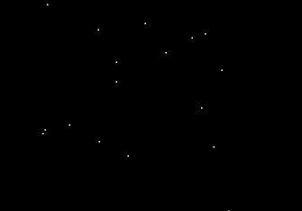
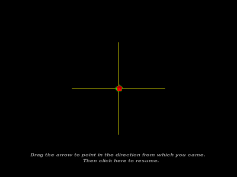

# starfield
This program simulates flying through a starfield, or snowstorm. It was written to simulate spacial movement and to collect user responses as to which direction that movement was in.

The program was written in C++ and utilizes libraries including :
  * OpenGL - https://www.opengl.org/
  * SDL - http://libsdl.org/
  * GLUT - https://www.opengl.org/resources/libraries/glut/
  * GLAUX -
  * FreeType - https://www.freetype.org/
  * inpout32 - http://www.highrez.co.uk/Downloads/InpOut32/
  
# Inputs
 The distance, direction, and number of movements are defined in a tab delineated script file. The default scripts path is in the program directory/scripts

  command line options:
	 * -f  turns off fullscreen mode
	 * m  turns on script mode		
	 * nNumber, (i.e n28) sets star density (approximate) (default 400, max 400)  
	 * rNumber, (i.e r35) sets the frame rate (default 100, depending on machine performance)  
	 * eNumber, (i.e e30) sets the Forgiveness range (i.e. -15 to +15 degrees)   
	 * dName,   Reads scripts from 'Name' sub directory (default is 'scripts')   
	 * pNumber, Specify the parallel port address, where Number is in Hex (i.e. p378)   
	 -* train, Turn off drawing of correct-response (ego or allo -see below) after subject has entered thier guess   
	         currently only for horizontal trials
	 * -offset,  Display correct response over selected response, else display separately.
	 * The program can optionally display feedback for horizontal trials only 
	         (command line option 'htrian', default is all trials)
	 * The program will display a feedback arrow for every 10th trial - Note: if the 'htrain' option is set 
	         and the 10th trial is NOT horizontal, feedback will NOT be displayed.

	 * ego, Provides egocentric feedback (default is allocentric feedback)
	 * c, Draw cross centered at the origin  
	 * offset : display green arrow and blue arrow side by side
	 * wireframe : display wireframe arrows
   
# key codes (for when the program is running)
	* use arrow keys for turning/looking in different directions 
	* use ctrl + arrow for moving (without turning)
	* a, z keys - accelerate forward/backwards
	* s, x keys - move forwared/backward into/out of the scene
	* d, c keys - rotate around the z axis
	* RETURN key - toggles pause
	* o key - toggles color on/off
	* p key - cycles point size, from 1 to 10
	* F1 key - toggles full screen
	* F8 key - toggle performace monitoring - modifies the star density
	 * based on accuracy of responses (measured as the angle between response and position vectors). 
    Based on the last 10 answered. (<70%=decreases(min=0), >90%=increases(max=400)) )
    
	 * F9 key - toggles frame rate (FPS) display
	 * ESC key - quit progrqam

# Outputs
This program was created to interface with EEG equipent, sending signals over a parallel port. 
Signals sent to the EEG recording include: 			
	* 9=start/end of a session.		
	* 1=Start of blank screen(1000ms before flow)		
	* 2=Onset of flow		
	* 3=Arrow on screen		
	* 4=First mouse click		
  
The output signals are also stored in text files in the program directory
	

